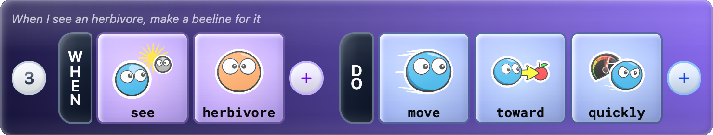

# Mindcraft Language

A tile-based programming language for creative coding applications.

<div align="center">
  
</div>

Mindcraft programs are built by arranging **tiles** -- typed, composable tokens -- into **rules**. Each rule has a WHEN side (condition) and a DO side (action). A collection of rules forms a **brain** that drives an autonomous actor. Host applications extend the language with custom types, sensors, and actuators.

The core library compiles to Roblox (Luau), Node.js, and browser (ESM) targets from a single TypeScript codebase.

Mindcraft draws inspiration from other tile-based programming systems past and present, including [Kodu Game Lab](https://www.kodugamelab.com/), [Project Spark](https://en.wikipedia.org/wiki/Project_Spark) ([Wiki](https://projectspark.fandom.com/wiki/How_the_brains_work)), and [MicroCode](https://microbit-apps.org/microcode-classic/docs/language).

## Demos

- [Ecosystem Sim](https://mindcraft-sim.humanappliance.io) -- carnivores, herbivores, and plants driven by user-editable Mindcraft brains

## Repository Structure

```
packages/
  core/       @mindcraft-lang/core -- language runtime (multi-target)
  ui/         @mindcraft-lang/ui -- shared React UI components
  docs/       @mindcraft-lang/docs -- shared documentation sidebar and rendering
apps/
  sim/        Ecosystem simulation demo
```

## Packages

| Package | Description |
|---------|-------------|
| [@mindcraft-lang/core](packages/core/) | Language runtime -- tiles, parser, compiler, VM (multi-target: Roblox, Node.js, ESM) |
| [@mindcraft-lang/ui](packages/ui/) | Shared React UI -- shadcn/ui primitives + brain editor components |
| [@mindcraft-lang/docs](packages/docs/) | Shared documentation subsystem -- renders as in-app sidebar or full-screen SPA |

## Apps

| App | Description |
|-----|-------------|
| [Ecosystem Sim](apps/sim/) | Demo: carnivores, herbivores, and plants driven by user-editable Mindcraft brains |

## Getting Started

Install the packages you need:

```bash
# Core only (language runtime, compiler, VM)
npm install @mindcraft-lang/core

# Core + UI (adds brain editor and shadcn/ui components)
npm install @mindcraft-lang/core @mindcraft-lang/ui

# Full stack (adds documentation sidebar and renderer)
npm install @mindcraft-lang/core @mindcraft-lang/ui @mindcraft-lang/docs
```

For full setup instructions -- Vite config, TypeScript paths, Tailwind, and component usage -- see the [Integration Guide](INTEGRATION.md).

## Documentation

Documentation is a work in progress. Browse the sim demo's [language documentation](https://mindcraft-sim.humanappliance.io/docs) online. See also the [core package README](packages/core/README.md) for language architecture, the [ui package README](packages/ui/README.md) for the shared React components, and the [docs package README](packages/docs/README.md) for the documentation system.

## Contributing

To report a bug or request a feature, please [open an issue](https://github.com/humanapp/mindcraft-lang/issues).

## License

[MIT](LICENSE)
