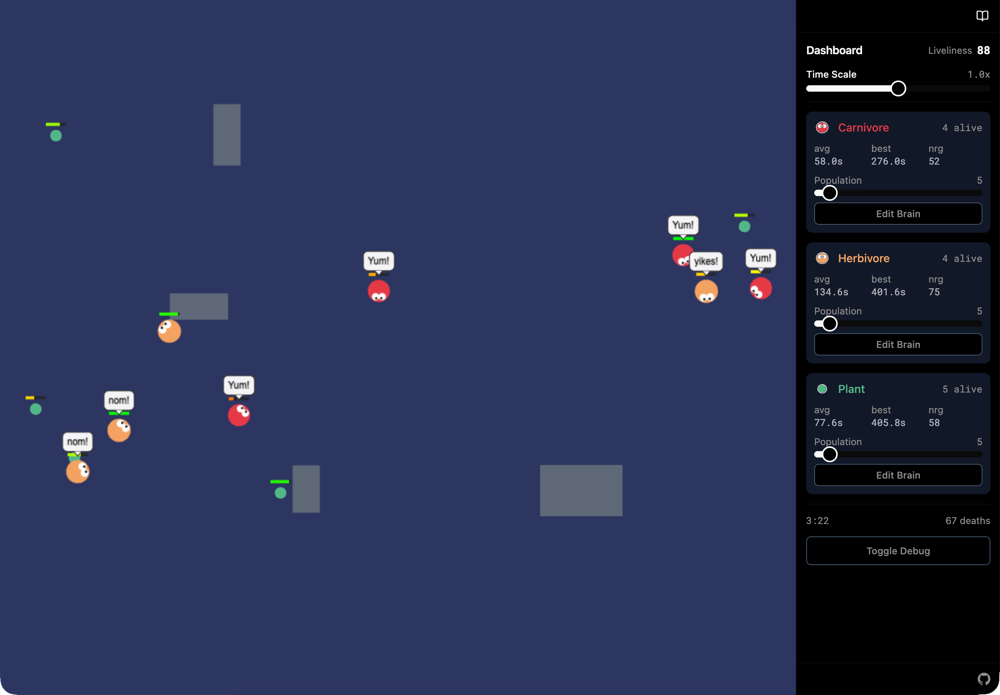
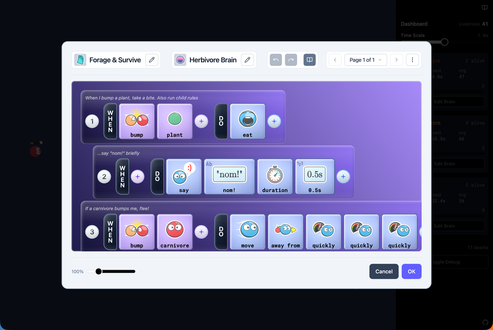

[](https://github.com/humanapp/wendoo-lang/actions/workflows/deploy-sim.yml)

# Ecosystem Sim

A demo application built with the [Wendoo language](../../README.md). Carnivores, herbivores, and plants survive in a 2D physics world -- each driven by a brain you can program.

**Live demo:** <https://sim.wendoo-lang.org> | **Language docs:** <https://sim.wendoo-lang.org/docs>

<div align="center">
  
</div>

<div align="center">
  
</div>

This app also serves as a reference integration for developers: it shows how to embed `@wendoo-lang/core` and `@wendoo-lang/ui` into a React application, and how to write custom sensors and actuators.

## Tech Stack

- **Vite** -- bundler
- **React 19** -- UI (sidebar, brain editor)
- **Phaser 3** -- game canvas with Matter.js physics
- **Tailwind CSS v4** -- styling
- **miniplex** -- ECS for actor management
- **@wendoo-lang/core** -- Wendoo language runtime (local dependency)
- **@wendoo-lang/ui** -- shared React UI components and brain editor (local dependency)
- **@wendoo-lang/docs** -- documentation content and assets (local dependency)

## Getting Started

From the monorepo root:

```bash
npm install
```

Then start the dev server:

```bash
cd apps/ecosim
npm run dev
```

Opens at `http://localhost:8080`.

## Scripts

| Command | Description |
|---------|-------------|
| `npm run dev` | Start Vite dev server (`--force` cache bypass) |
| `npm run build` | Build `packages/core` first, then Vite production build |
| `npm run generate:ambient` | Regenerate checked-in core and sim ambient declaration files |
| `npm run clean` | Remove `dist/` and Vite cache |
| `npm run lint` | Biome lint |
| `npm run format` | Biome format |
| `npm run check` | Biome check (lint + format) |

## Project Structure

```
src/
  main.tsx              React entry point
  App.tsx               Root layout: Phaser canvas + sidebar + brain editor
  PhaserGame.tsx        React <-> Phaser bridge
  bootstrap.ts          Startup: logger, services, brain registration
  brain-editor-config.tsx  BrainEditorConfig for @wendoo-lang/ui provider
  globals.css           Tailwind, fonts, theme tokens

  brain/                Simulation engine + brain language integration
    actor.ts              Actor entity (brain, mover, vision, queues)
    archetypes.ts         Carnivore/herbivore/plant config
    engine.ts             ECS world, tick loop, spawning, collisions
    score.ts              Score tracker + snapshot types
    movement.ts           Mover + steering helpers (Matter.js)
    vision.ts             Cone-based, obstacle-occluded sight queries
    type-system.ts        App-specific types (ActorRef, Vector2)
    tileids.ts            Tile ID string constants
    fns/                  Host function implementations
      sensors/              Bump, See
      actuators/            Move, Eat, Say, Turn, Shoot
    tiles/                Tile definitions + visual config

  game/                 Phaser game layer
    main.ts               Phaser Game config + StartGame factory
    scenes/               Boot -> Preloader -> Playground

  components/           React UI
    Sidebar.tsx             Dashboard (stats, time scale, population)

  services/             Platform services
    brain-persistence.ts    localStorage save/load for brains (binary + base64)
    population-persistence.ts  localStorage save/load for desired population counts

  lib/                  Sim-specific utilities
    color.ts              heatColor(), energyTint() for Phaser rendering
```

## Brain Editor Integration

The brain editor UI lives in `@wendoo-lang/ui`. The sim provides app-specific configuration via `BrainEditorProvider`:

- `brain-editor-config.tsx` builds a `BrainEditorConfig` with data type icons, tile visuals, a Vector2 custom literal type, and an archetype-scoped `getDefaultBrain` factory
- `App.tsx` wraps the `BrainEditorDialog` in a `<BrainEditorProvider>` with this config

UI primitives (Button, Slider, etc.) are also imported from `@wendoo-lang/ui` rather than local shadcn/ui copies.

## Ambient Type Declarations

The sim contributes a checked-in ambient declaration file at `lib/wendoo.ecosim.d.ts`.
It augments the core `"wendoo"` module with the sim-specific user-code surface:
`ActorRef`, `Vector2`, sim entries in `WendooTypeMap`, `Context.self`, and sim
methods on `BrainContext` and `EngineContext`.

Generate it from `apps/ecosim/`:

```bash
npm run generate:ambient
```

This command first runs core's ambient generator, then writes the sim augmentation. The
core file remains owned by `@wendoo-lang/core`; the sim reads it from the package
export and pairs it with `lib/wendoo.ecosim.d.ts` in `src/services/sim-ambient-files.ts`.
The workspace compiler and VS Code bridge expose both files as readonly compiler-owned
root files named `wendoo.core.d.ts` and `wendoo.ecosim.d.ts`.

Regenerate the sim ambient file whenever the sim changes anything visible to user-authored
Wendoo TypeScript: registered sim types, context fields, sensors, actuators, host
method signatures, or argument grammar metadata that affects callable types. The generated
files should be checked in. The drift test in `src/services/sim-ambient-files.spec.ts`
regenerates core and sim declarations and fails if the checked-in files differ.

## Language Component Registration

The sim registers app-specific brain components in three layers:

1. **Types** (`brain/type-system.ts`) -- custom `ActorRef` and `Vector2` struct types
2. **Host functions** (`brain/fns/`) -- sensor and actuator implementations that read/write actor state
3. **Tiles** (`brain/tiles/`) -- tile definitions with visual metadata (labels, icons, colors) for the editor

Registration happens in `bootstrap.ts` at startup. The core library's `registerCoreBrainComponents()` runs first, then the sim's `registerBrainComponents()`.

### Adding a Sensor or Actuator

1. Create the host function in `brain/fns/sensors/` or `brain/fns/actuators/`
2. Register it in the corresponding `index.ts`
3. Add the tile definition in `brain/tiles/sensors.ts` or `brain/tiles/actuators.ts`
4. Add tile ID constants to `brain/tileids.ts`

Each sensor/actuator exports an `ActionDef` containing the tile ID, argument grammar (`callDef`), host function, return type, and visual metadata.
