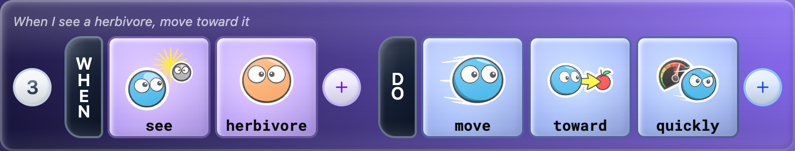
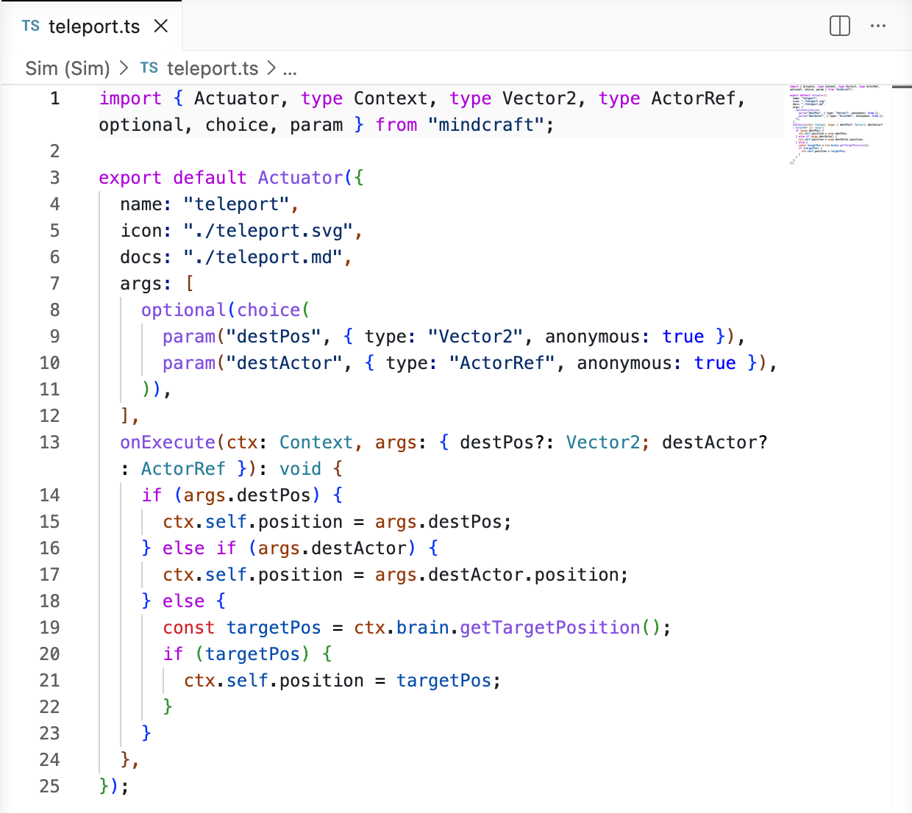

**Mindcraft**: A tile-based programming language for creative coding applications.

  

Mindcraft programs are built by arranging **tiles** -- typed, composable tokens -- into **rules**. A collection of rules forms **brains** that drive in-game actors. 

The **Mindcraft VS Code Web extension** lets you **define custom sensor and actuator tiles in TypeScript**. A live bridge connects VS Code to a running Mindcraft app -- edit a source file and your new tile is instantly available for use in the brain editor. No local toolchain required.

_Example: Authoring a "teleport" actuator in TypeScript:_

  

